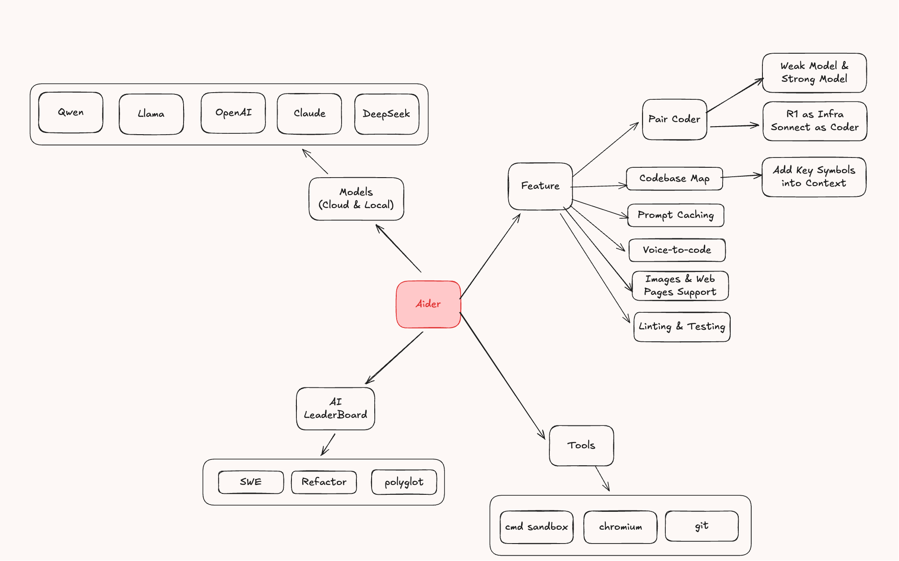
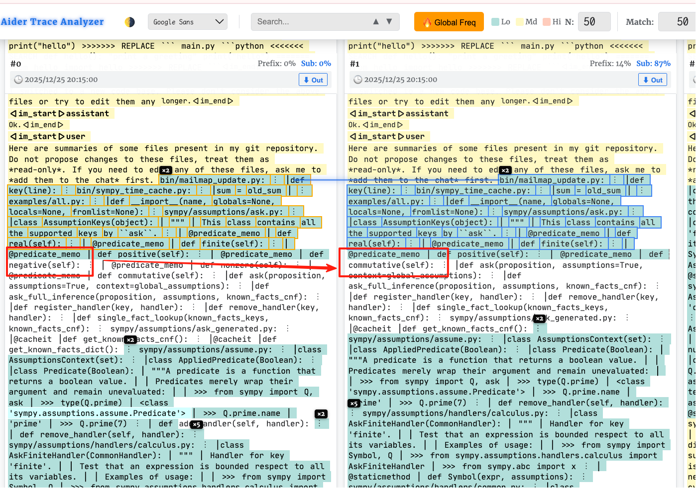
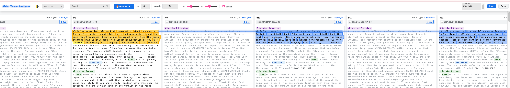
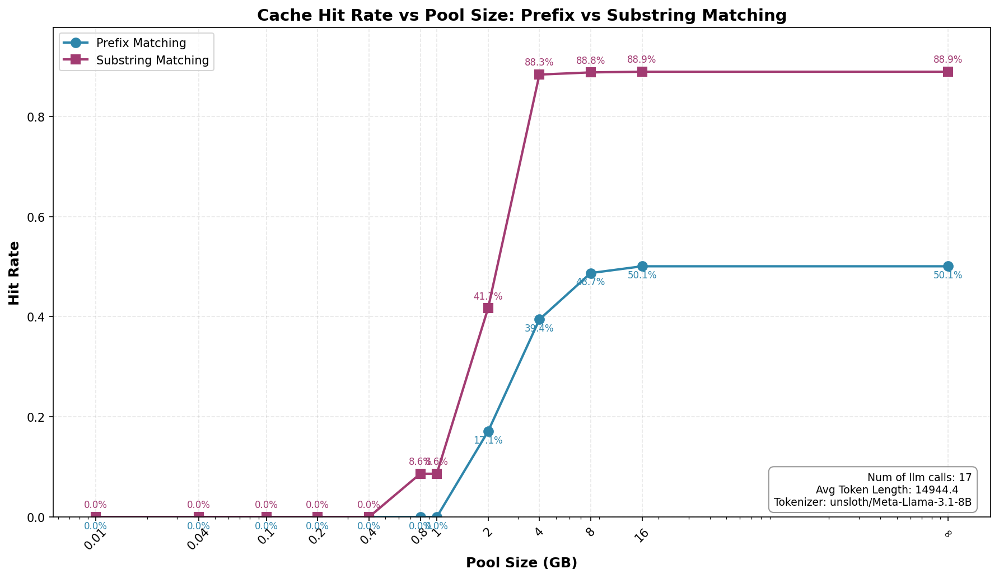
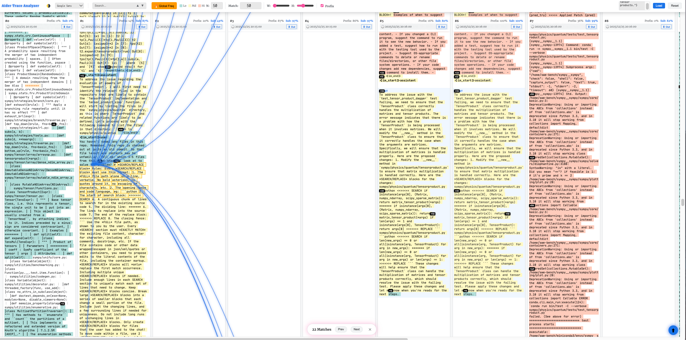

# Aider Trace Analysis & Prefix Caching Case Study

This document analyzes the execution traces generated by [Aider](https://github.com/Aider-AI/aider) (an AI pair programming agent) running on the [SWE-bench](https://github.com/Aider-AI/aider-swe-bench) benchmark. It demonstrates Aider's unique prompt structure and the potential for **KV Cache reuse** (Prefix Caching vs. Substring Caching).

<div align=center>

</div>

---

## 💡 Background: Cache Types

We categorize KV cache reuse scenarios into two types:

* **Prefix Match**
    * Matches that are identical starting from the very beginning of the prompt (index 0). Even a single different token breaks the chain for all subsequent content.

* **Substring Match**
    * Repeated text blocks located in the middle or end of the prompt, where the preceding content has changed.

---

## 🔍 Insight: Why Prefix Cache Fails (With Code Evidence)

We observed that Aider's prompt structure frequently causes "shifts" or "truncations" in repeated content, making Substring Caching essential.

### 1. Normal Request (Repo Map Shift)

Aider inserts a dynamic `Repo Map` (codebase summary) in the middle of the prompt.

#### Prompt Structure:

```python
[System Prompt]       # ✅ Static Prefix
[Repo Map]            # ⚠️ Dynamic (Small changes breakdown prefix)
[Read-only Files]     # ❌ Offset shifted (Needs Substring Cache)
[Chat History]        # ❌ Offset shifted (Needs Substring Cache)
```


#### 🔬 Code Evidence:

In `aider/coders/base_coder.py`, the `ChatChunks` class defines the strict order of messages. The dynamic content (`readonly_files`, `repo`) is hardcoded to be inserted **before** the history (`done`), causing the shift.

```python
@dataclass
class ChatChunks:
    system: List = field(default_factory=list)          # Static System Prompt
    examples: List = field(default_factory=list)
    readonly_files: List = field(default_factory=list)  # <--- Dynamic Content
    repo: List = field(default_factory=list)            # <--- Dynamic Repo Map
    done: List = field(default_factory=list)            # <--- Chat History (Pushed back)
    # ... other fields ...

    def all_messages(self):
        return (
            self.system
            + self.examples
            + self.readonly_files   # Inserted BEFORE history
            + self.repo             # Inserted BEFORE history
            + self.done             # The reused history block
            + self.chat_files
            + self.cur
            + self.reminder
        )
```

<div align=center>

</div>

> **Analysis**: Even a 1-token change in the `Repo Map` breaks the prefix match for all subsequent `Files` and `History`.

---

### 2. Summary Mechanism Analysis (Two-Stage Failure)

The summarization mechanism in Aider disrupts Prefix Caching in two distinct stages.

#### 2.1 Stage 1: The Summarization Request (Prompt Injection)

When Aider decides to compress history, it first sends a **separate request** to the LLM to generate the summary.

* **Prompt Structure Comparison**:
```python
# Previous Turn (Main Chat)
[System: Act as Dev] + [Repo Map] + [History Chunk A]
                                            ^
                                            | Identical Content
# Summarization Request                     |
[System: Summarize following]     + [History Chunk A]
```

<div align=center>

</div>

> **Analysis**: The `[History Chunk A]` exists in the KV Cache. However, because it is now preceded by `[System: Summarize following]` instead of `[Repo Map]`, the prefix chain is broken.

#### 2.2 Stage 2: The Post-Summary Chat (Summary Injection)

After the summary is generated, Aider injects it back into the main chat history.

#### Prompt Structure:

```python
[System Prompt]
[Repo Map]
[Generated Summary]   # ⚠️ New Insertion!
[Chat History (Tail)] # ❌ Shifted due to insertion (Needs Substring Cache)
```


#### 🔬 Code Evidence:

In `ChatSummary`, Aider does not simply truncate history. It generates a summary and **prepends** it to the remaining messages (`tail`), causing the "shift."

```python
class ChatSummary:
    def summarize_real(self, messages, depth=0):
        # ... logic to split head and tail ...
        
        tail = messages[split_index:]        # The repeated history part
        summary = self.summarize_all(keep)   # Generate summary for the head
        
        # 🚧 The summary pushes the tail backwards
        return summary + tail

```

> **Conclusion**: In both stages, standard Prefix Caching fails completely. Only **Substring Caching** can identify that `[History Chunk A]` and `[Chat History (Tail)]` are reusable blocks despite the header changes and position shifts.

---

## 📈 Case Analysis


We conducted a detailed analysis on the trace `gpt_4o_astropy__astropy-13977.jsonl` to evaluate the effectiveness of LMCache under different constraints.

### 1. Cache Hit Rate vs. Memory Limit

The following figure illustrates the achievable cache hit rate under varying memory constraints. The data is calculated based on `prefix_analysis.py`.

<div align=center>

</div>

> **Observation**: Substring Match maintains a high hit rate even when memory is restricted, significantly outperforming standard prefix caching strategies which drop to near zero once the context shifts.

### 2. Trace Visualization & Substring Redundancy

Using our visualization tool, we inspected the internal structure of the trace to identify patterns of repetition.

<div align=center>

</div>

**Key Findings**:

* **High Substring Overlap**:
According to the **Global Frequency** labels (the superscripts in the visualizer), we observed an extremely high degree of text reuse.

* **Quantitative Example**:
When the **N-Gram is set to 50** (meaning only text blocks longer than 50 tokens are considered), we still observe a massive amount of highlighted overlapping blocks.

* **Interpretation**:
This confirms that although the *absolute prefix* is broken by dynamic content (like Repo Maps), the bulk of the content (huge code definitions and history segments) remains identical as "substrings" across different requests.

---

## 🛠 Visualization Tool

We provide a dedicated visualizer to explore these traces interactively. You can load raw `.jsonl` trace files to inspect token distribution and cache hits.

* **Online Visualizer**: [lmcache-aider-trace visualizer](https://lmcache-aider-trace.netlify.app/)


---

## Appendix: Setup & Execution Guide

For those who wish to reproduce our test results directly, we have prepared a dedicated repository containing all necessary patches and scripts. 

* Repository: https://github.com/guaguastandup/aider-swebench-patch

* Instruction: Please refer to the README.md in that repository for detailed configuration and execution steps.